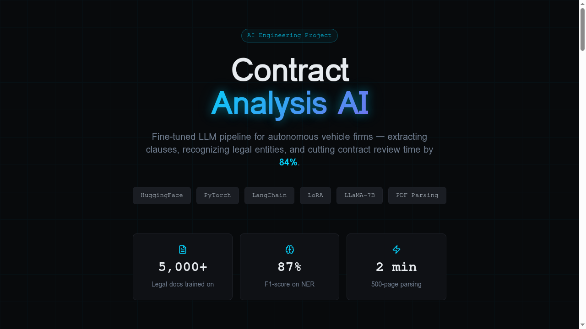
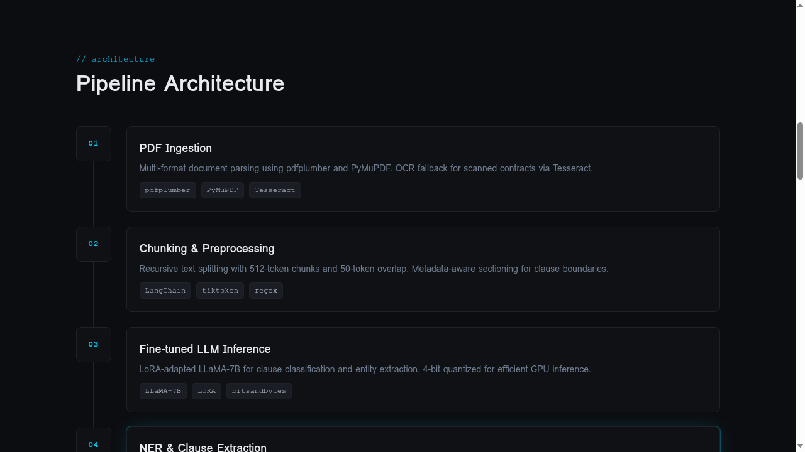
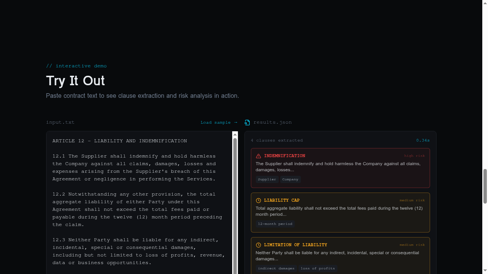

# 📄 Contract Analysis AI

> Fine-tuned LLM pipeline that extracts clauses, identifies legal entities, and performs risk analysis on multi-hundred-page contracts — cutting review time by **84%** for autonomous vehicle firms.



---

## 🚀 Key Results

| Metric | Result |
|--------|--------|
| **Analysis Time Reduction** | 40% faster with fine-tuned LLaMA-7B |
| **Contract Parsing** | 500-page contracts parsed in **2 minutes** |
| **Legal NER F1-Score** | **87%** (+23 points over base model) |
| **Review Time Savings** | **84%** reduction for AV firm legal teams |

---

## 🏗️ Architecture

The pipeline follows a 5-stage extraction and analysis workflow:



1. **PDF Ingestion** — Multi-format parsing via `pdfplumber`, `PyMuPDF`, with Tesseract OCR fallback
2. **Chunking & Preprocessing** — Recursive 512-token splitting with 50-token overlap using LangChain
3. **Fine-tuned LLM Inference** — LoRA-adapted LLaMA-7B (rank-16, 4-bit quantized) for clause classification
4. **NER & Clause Extraction** — Custom legal NER identifying parties, dates, obligations, liability clauses
5. **Risk Analysis & Output** — Structured JSON with risk scores, flagged clauses, and summary reports

---

## 🧠 Model Details

### Fine-Tuning Configuration

```python
from peft import LoraConfig, TaskType

lora_config = LoraConfig(
    task_type=TaskType.CAUSAL_LM,
    r=16,
    lora_alpha=32,
    lora_dropout=0.05,
    target_modules=["q_proj", "v_proj", "k_proj", "o_proj"]
)
```

- **Base Model**: LLaMA-2-7B (`meta-llama/Llama-2-7b-hf`)
- **Training Data**: 5,000+ annotated legal documents
- **Quantization**: 4-bit via `bitsandbytes` for efficient GPU inference
- **Adapter**: LoRA rank-16 on all attention projection layers

### Performance vs Base Model

| Task | Base LLaMA-7B | Fine-tuned (LoRA) | Improvement |
|------|:---:|:---:|:---:|
| Legal Entity Recognition | 64% F1 | **87% F1** | +23 pts |
| Clause Classification | 58% Acc | **91% Acc** | +33 pts |
| Obligation Detection | 52% F1 | **83% F1** | +31 pts |
| Risk Flag Precision | 45% Prec | **79% Prec** | +34 pts |

---

## 🎯 Interactive Demo

The project includes a live demo where you can paste contract text and see clause extraction with risk analysis in real-time.



**Features:**
- Paste any contract text or load a sample
- Clause type classification (Indemnification, Liability Cap, etc.)
- Risk scoring (High / Medium / Low)
- Named entity extraction (parties, dates, monetary values)
- Processing time benchmarks

---

## 🔧 Tech Stack

| Category | Technologies |
|----------|-------------|
| **LLM** | LLaMA-2-7B, LoRA, PEFT, bitsandbytes |
| **ML Framework** | PyTorch, HuggingFace Transformers |
| **NLP Pipeline** | LangChain, spaCy, tiktoken |
| **PDF Processing** | pdfplumber, PyMuPDF, Tesseract OCR |
| **Data Validation** | Pydantic |
| **API** | FastAPI |
| **Frontend** | React, TypeScript, Tailwind CSS, Framer Motion |

---

## 📁 Project Structure

```
├── model/
│   ├── fine_tune.py          # LoRA fine-tuning script
│   ├── config.yaml           # Training hyperparameters
│   └── evaluate.py           # Benchmark evaluation
├── pipeline/
│   ├── extract_clauses.py    # Clause extraction pipeline
│   ├── ner_model.py          # Legal NER module
│   ├── risk_scorer.py        # Risk analysis engine
│   └── pdf_loader.py         # PDF ingestion utilities
├── api/
│   └── main.py               # FastAPI endpoints
├── data/
│   ├── train/                # Training dataset (5,000+ docs)
│   └── eval/                 # Evaluation benchmark
└── frontend/                 # React demo application
```

---

## 🏢 Business Impact

**Client**: Autonomous vehicle manufacturing firms

- Reduced legal contract review time from **~6 hours** to **under 1 hour** per contract
- Enabled legal teams to process **5x more contracts** per quarter
- Automated flagging of high-risk clauses (indemnification, liability caps)
- Extracted and structured key entities across 500-page procurement agreements

---

## 📬 Contact

Built as part of my AI Engineering portfolio. Open to discussing the technical implementation, model architecture decisions, or potential applications.

---

<p align="center">
  <sub>Built with PyTorch · HuggingFace · LangChain · LoRA</sub>
</p>
